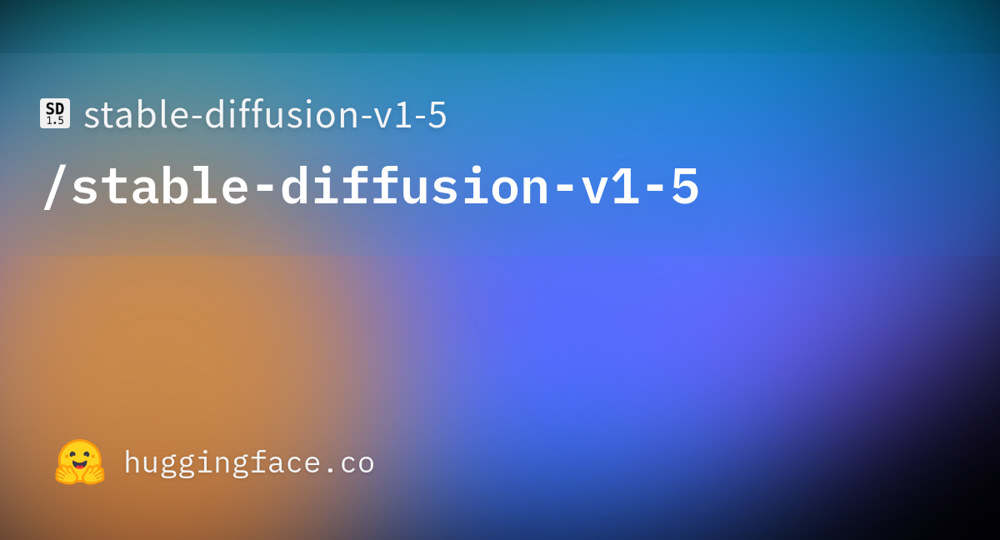
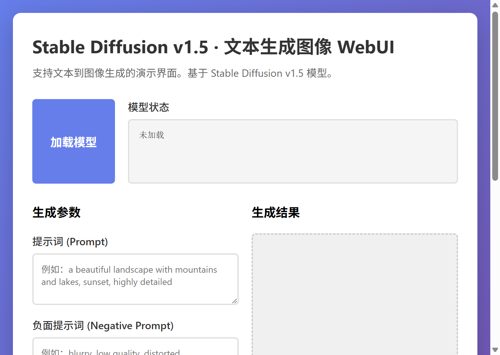

# Stable Diffusion v1.5 WebUI

## 项目概述

Stable Diffusion v1.5 是一个基于潜在扩散模型的文本到图像生成系统，能够根据文本描述生成高质量、逼真的图像。本项目提供了一个基于 Gradio 的 Web 用户界面，使得用户可以通过直观的图形界面与 Stable Diffusion v1.5 模型进行交互，无需编写代码即可完成图像生成任务。更多相关项目源码请访问：http://www.visionstudios.ltd

Stable Diffusion 模型采用了潜在扩散模型（Latent Diffusion Model）的架构，这是一种在潜在空间而非像素空间进行扩散过程的生成模型。该模型的核心创新在于将图像编码到低维潜在空间，在这个压缩的表示空间中进行扩散过程，从而大幅降低了计算复杂度，使得在消费级硬件上运行大规模图像生成模型成为可能。

## 技术原理

Stable Diffusion v1.5 模型基于 Rombach 等人在 2022 年提出的潜在扩散模型架构。该模型主要由三个核心组件构成：变分自编码器（VAE）、U-Net 去噪网络和 CLIP 文本编码器。相关技术论文请访问：https://www.visionstudios.cloud

变分自编码器负责将高分辨率图像编码到低维潜在空间，同时能够将潜在表示解码回原始图像空间。这种编码-解码机制使得模型可以在 64×64 的潜在空间中进行扩散过程，而不是在原始 512×512 的像素空间，从而将计算量降低了约 64 倍。U-Net 网络是扩散过程的核心，它通过逐步去噪的方式将随机噪声转换为有意义的潜在表示。该网络采用交叉注意力机制，能够将文本条件信息融入到图像生成过程中，确保生成的图像与输入文本描述高度一致。

CLIP 文本编码器将自然语言描述转换为高维向量表示，这些向量包含了文本的语义信息。在生成过程中，文本编码被注入到 U-Net 的各个层中，通过交叉注意力机制指导图像生成的方向。这种设计使得模型能够理解复杂的文本描述，并将其转换为相应的视觉内容。

Stable Diffusion v1.5 是在 Stable Diffusion v1.2 的基础上进行微调得到的。该版本在 LAION-Aesthetics v2 5+ 数据集上进行了 595,000 步的训练，训练分辨率为 512×512。为了提高生成质量，训练过程中采用了 10% 的文本条件丢弃策略，这有助于改善无分类器引导采样（Classifier-Free Guidance）的效果。

## 模型架构

模型的架构设计体现了现代生成模型的最佳实践。VAE 编码器将 512×512×3 的图像压缩到 64×64×4 的潜在表示，压缩比为 8:1。这种压缩不仅降低了计算成本，还保留了图像的关键特征信息。U-Net 网络采用深度残差结构，包含多个下采样和上采样层，能够捕获从局部细节到全局结构的多个尺度的特征。

文本编码器采用 CLIP ViT-L/14 架构，这是一个在大规模图像-文本对数据上预训练的视觉-语言模型。该编码器能够将文本描述映射到与图像特征对齐的语义空间，使得文本和图像在同一个表示空间中，从而实现了精确的文本到图像的转换。

扩散过程采用去噪扩散概率模型（DDPM）的框架。该过程从随机噪声开始，通过多步迭代逐步去除噪声，最终生成清晰的图像。每一步的去噪操作都由 U-Net 网络完成，网络根据当前噪声水平和文本条件预测应该去除的噪声量。通过控制去噪的步数和引导强度，可以平衡生成速度和质量。

## 训练过程

Stable Diffusion v1.5 的训练过程体现了大规模生成模型训练的复杂性。训练使用了 32 个节点，每个节点配备 8 块 A100 GPU，总共 256 块 GPU。训练采用 AdamW 优化器，学习率在 10,000 步内从 0 线性增加到 0.0001，之后保持恒定。批次大小为 2048，通过梯度累积实现，每个 GPU 的批次大小为 4，梯度累积步数为 2。

训练数据来自 LAION-5B 数据集的子集，特别是 LAION-Aesthetics v2 5+ 数据集。该数据集经过精心筛选，只包含美学评分高于 5.0 且水印概率低于 0.5 的高质量图像。这种数据筛选策略确保了模型学习到的是高质量、多样化的视觉内容。

训练过程中采用了多种技术来提高模型的稳定性和生成质量。除了文本条件丢弃策略外，还使用了指数移动平均（EMA）来稳定模型权重。模型提供了两个版本的权重：EMA-only 版本和完整版本。EMA-only 版本占用更少的显存，适合推理使用；完整版本包含 EMA 和非 EMA 权重，适合进一步微调。

## 应用场景

Stable Diffusion v1.5 在多个领域都有广泛的应用前景。在艺术创作领域，艺术家和设计师可以使用该模型快速生成概念图、插画和视觉设计元素。在教育领域，教师可以使用该模型生成教学材料，帮助学生更好地理解抽象概念。在研究和开发领域，该模型可以用于数据增强、概念验证和原型设计。项目专利信息请访问：https://www.qunshankj.com

在商业应用中，该模型可以用于广告设计、产品可视化、游戏资产生成等多个场景。通过提供直观的 Web 界面，本项目降低了模型使用的技术门槛，使得非技术用户也能够利用先进的 AI 技术进行创作。

## WebUI 界面

本项目提供的 Web 用户界面基于 Gradio 框架构建，提供了友好的交互体验。界面包含模型加载、参数设置和图像生成等核心功能。用户可以通过简单的点击和输入完成复杂的图像生成任务，无需了解底层的技术细节。

界面设计遵循直观易用的原则，将复杂的参数设置组织成清晰的布局。用户可以通过滑块调整采样步数、引导强度等关键参数，通过文本输入框输入提示词和负面提示词。生成的结果会实时显示在界面上，用户可以立即查看效果并进行调整。

## 使用方法

使用本项目的 WebUI 界面进行图像生成非常简单。首先，用户需要确保已经安装了所需的依赖包，包括 Gradio、PyTorch、Diffusers 等。安装完成后，运行 `app.py` 或 `app_simple.py` 文件即可启动 Web 服务器。

启动后，用户可以通过浏览器访问本地地址（通常是 http://127.0.0.1:7860）来打开界面。在界面上，用户首先需要点击"加载模型"按钮来初始化模型。虽然演示版本不加载真实的模型权重，但实际使用时需要下载完整的模型文件。

加载模型后，用户可以在提示词输入框中输入想要生成的图像描述。提示词应该尽可能详细和具体，描述想要生成的图像的内容、风格、色彩等特征。负面提示词用于指定不希望在生成图像中出现的内容，这有助于提高生成质量。

参数设置部分允许用户调整生成过程的细节。采样步数控制去噪过程的迭代次数，更多的步数通常会产生更高质量的图像，但也会增加生成时间。引导强度控制文本条件对生成过程的影响程度，较高的值会使生成的图像更紧密地遵循文本描述。

设置完成后，点击"生成图像"按钮即可开始生成过程。生成时间取决于设置的采样步数和硬件性能。生成完成后，图像会显示在结果区域，用户可以保存或进一步调整参数重新生成。

## 技术特点

Stable Diffusion v1.5 的技术特点使其在同类模型中脱颖而出。首先，潜在空间的扩散过程大大降低了计算需求，使得模型可以在消费级 GPU 上运行。其次，基于 CLIP 的文本编码确保了文本和图像之间的精确对齐，使得模型能够准确理解复杂的文本描述。

模型的另一个重要特点是其开放性和可扩展性。模型权重以开放许可发布，允许研究者和开发者自由使用和修改。同时，模型架构支持多种扩展，包括 ControlNet、LoRA 等技术，可以进一步扩展模型的功能。

## 性能评估

根据官方评估结果，Stable Diffusion v1.5 在多个指标上都表现出色。使用 COCO2017 验证集的 10,000 个随机提示词进行评估，模型在不同引导强度下都保持了良好的性能。评估采用 50 步 PLMS 采样，分辨率为 512×512。

模型的生成质量在多个方面都达到了业界领先水平。在图像清晰度、细节丰富程度、文本-图像一致性等方面，模型都表现出了优异的性能。同时，模型的计算效率也使其在实际应用中具有显著优势。

## 环境要求

运行本项目需要满足一定的硬件和软件要求。硬件方面，建议使用 NVIDIA GPU，至少 4GB 显存。对于完整模型推理，推荐使用 8GB 或更多显存。软件方面，需要 Python 3.8 或更高版本，以及相应的深度学习框架。

依赖包包括 Gradio（用于 Web 界面）、PyTorch（深度学习框架）、Diffusers（扩散模型库）、Transformers（文本编码器）等。所有依赖都可以通过 pip 安装，项目提供了 requirements.txt 文件方便一键安装。

## 总结

Stable Diffusion v1.5 WebUI 项目为先进的文本到图像生成技术提供了易于使用的接口。通过结合强大的模型能力和直观的用户界面，该项目使得 AI 图像生成技术更加普及和易用。无论是研究人员、艺术家还是普通用户，都可以通过本项目体验到最新的 AI 图像生成技术。

随着 AI 技术的不断发展，文本到图像生成模型将在更多领域发挥重要作用。本项目不仅提供了当前技术的实现，也为未来的扩展和改进奠定了基础。通过开源的方式，我们希望更多的开发者能够参与到这个领域的研究和开发中，共同推动 AI 图像生成技术的发展。

